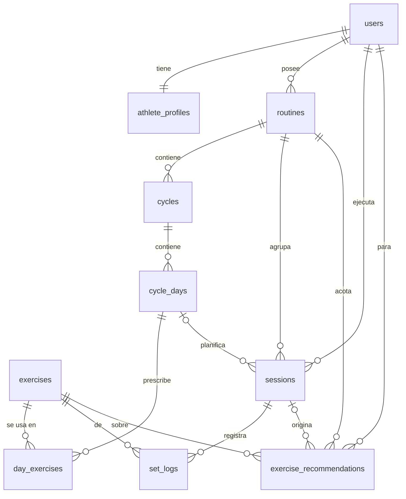

# Modelo de datos — v1

> Deriva de `docs/product-context.md` (el contrato). Este documento describe el
> DER de la v1: qué almacena cada tabla, columna por columna, y las relaciones.
> Los enums viven en `app/Enums/` (ver [Enums](#enums)).

## Convenciones

- Toda tabla de dominio tiene `id` `bigint` autoincremental como PK **interna** y
  `created_at` / `updated_at` (`timestamptz`). No se listan en cada tabla salvo
  que aporten semántica. Las tablas expuestas por la API llevan además un `uuid`
  público — ver [Identificadores](#identificadores-id-interno--uuid-público).
- **Sin soft deletes** en v1. El historial se conserva por estado
  (`archived` / `completed` / `superseded`), no borrando filas.
- FKs con `ON DELETE CASCADE` cuando el hijo no tiene sentido sin el padre
  (`cycles` → `routines`, `set_logs` → `sessions`, …). `exercise_id` **nunca**
  cascadea: el catálogo es permanente.
- Pesos en **kg**, `decimal(6,2)`. RPE `decimal(3,1)` (rango 0–10).
- Índices únicos parciales de PostgreSQL para los invariantes de "uno activo a
  la vez".
- Tablas de framework (`users` la extendemos; `cache`, `jobs`,
  `agent_conversations*` son de librería) descritas al final.

## Identificadores: `id` interno + `uuid` público

Las tablas **expuestas por la API** llevan **dos** claves:

- `id` `bigint` autoincremental — **PK e interna**. Todas las FKs entre tablas
  apuntan a esta. Nunca sale en una respuesta JSON ni aparece en una URL.
- `uuid` `uuid` `unique not null` — **identificador público**. Es el único
  identificador que cruza la frontera de la API: route-model binding
  (`/api/v1/routines/{routine}` resuelve por `uuid`) y el campo `id` de cada JSON
  Resource (`'id' => $this->uuid`).

Así la API no filtra el orden de creación ni el volumen de filas.

- **UUID v4 (aleatorio)**, no v7: el objetivo es *no* revelar el orden temporal,
  y v7 embebe el timestamp de creación. Costo asumido: un índice secundario con
  inserción no secuencial (aceptable — no es la PK, solo esa columna).
- Generación en el modelo vía trait compartido `HasPublicUuid`: rellena `uuid`
  en el evento `creating` con `Str::uuid()` (v4) y fija
  `getRouteKeyName(): string => 'uuid'`. **No** se usa el trait `HasUuids` de
  Laravel: convertiría la PK a `string` no incremental.
- Índice `unique` en `uuid`.
- Tablas **internas** (nunca direccionadas por identificador propio): solo `id`.
  `athlete_profiles` se accede siempre como "el perfil del usuario actual"
  (`/api/v1/profile`, sin id en la URL); las tablas de framework quedan como
  vienen. `users` tampoco lleva `uuid` en v1 — la API solo opera sobre el usuario
  autenticado, nunca por id.

**Llevan `uuid`:** `routines`, `cycles`, `cycle_days`, `day_exercises`,
`exercises`, `sessions`, `set_logs`, `exercise_recommendations`.

## Decisiones tomadas (por defecto, ajustables)

| # | Decisión | Elegido |
|---|---|---|
| 1 | Grupos musculares | Enum fijo `MuscleGroup` (primera lista, abajo) |
| 2 | `focus_muscle_groups` | `jsonb` (array de enum) en `cycle_days`, sin pivote |
| 3 | Reps (prescripción y recomendación) | Rango `rep_min` / `rep_max` |
| 4 | `confidence` | Enum `low` / `medium` / `high` |
| 5 | Dedupe de ejercicios | Solo log; sin tabla `exercise_aliases` en v1 |
| 6 | Prescrito vs. real | Se deriva por `sessions.cycle_day_id`; sin FK extra en `set_logs` |

## Diagrama ER

---

## `athlete_profiles`

**Qué almacena:** el perfil de atleta que el usuario carga en el onboarding.
Es entrada directa a los prompts de la IA (el planificador y el analista lo
reciben tal cual). Exactamente **uno por usuario** (1:1).

| Columna | Tipo | Descripción |
|---|---|---|
| `user_id` | `bigint` FK → `users`, **unique** | Dueño del perfil. `unique` fuerza el 1:1. Interna: sin `uuid`, se accede como perfil del usuario actual. |
| `experience_level` | `enum ExperienceLevel` | `beginner` / `intermediate` / `advanced`. Calibra volumen e intensidad que propone la IA. |
| `days_per_week` | `smallint` | Días por semana que el usuario dice tener disponibles. |
| `session_minutes` | `smallint` | Duración objetivo de cada sesión, en minutos. Acota cuántos ejercicios prescribe la IA. |
| `goal` | `enum Goal` | Objetivo general del usuario. Sirve de **valor por defecto** al crear una rutina; cada rutina luego lleva su propio `goal`. |
| `notes` | `text` null | Texto libre: lesiones, ejercicios que prefiere/evita, split preferido, limitaciones de equipo. Se pasa a la IA sin procesar. |

**Reglas**
- Se crea/actualiza en el onboarding; editable siempre (no forma parte del
  historial inmutable).

---

## `routines`

**Qué almacena:** cada programa de entrenamiento del usuario. Un usuario puede
tener **varias**, pero **solo una `active`**; el resto quedan `archived` de forma
permanente (solo lectura, no reactivables, no editables) conservando todo su
historial. Archivar es siempre efecto de crear/activar otra rutina, nunca una
acción manual.

| Columna | Tipo | Descripción |
|---|---|---|
| `uuid` | `uuid`, **unique** | Identificador público (route-model binding + campo `id` del Resource). |
| `user_id` | `bigint` FK → `users` | Dueño de la rutina. |
| `name` | `string` | Etiqueta libre del usuario ("Volumen invierno"). |
| `goal` | `enum Goal` | Objetivo propio de **esta** rutina, independiente del `goal` del perfil. Alimenta al planificador de ciclos. |
| `days_per_cycle` | `smallint` (default 5) | Días por ciclo. Fijo en 5 en v1 (el campo existe pero no se expone para editar). |
| `status` | `enum RoutineStatus` | `active` o `archived`. |
| `archived_at` | `timestamptz` null | Momento en que se archivó (al activarse otra rutina). `null` mientras está activa. |

**Reglas**
- Índice único parcial: `(user_id) WHERE status = 'active'` → como máximo una
  rutina activa por usuario.
- En v1 no se edita después de crearla (ni `name` ni `goal`).

---

## `cycles`

**Qué almacena:** una **semana** de una rutina. Registra su lugar en la
secuencia, en qué punto del ciclo de vida está, el racional del split que
devolvió la IA y cuándo ocurrió cada transición.

| Columna | Tipo | Descripción |
|---|---|---|
| `uuid` | `uuid`, **unique** | Identificador público (route-model binding + campo `id` del Resource). |
| `routine_id` | `bigint` FK → `routines` | Rutina a la que pertenece. |
| `sequence_number` | `int` | Número de semana dentro de la rutina: 1, 2, 3… |
| `status` | `enum CycleStatus` | `generating` (job encolado corriendo) → `draft` (IA terminó, falta activar) → `active` (en curso) → `completed` (llegó el siguiente) / `failed` (el job falló). |
| `split_rationale` | `text` null | Explicación de la IA sobre por qué eligió ese reparto de grupos musculares por día. `null` mientras `generating` / `failed`. |
| `conversation_id` | `string(36)` FK → `agent_conversations` null | Conversación IA que generó el ciclo. Traza / auditoría. |
| `generated_at` | `timestamptz` null | Cuándo la IA devolvió el ciclo (pasó a `draft`). |
| `activated_at` | `timestamptz` null | Cuándo el usuario lo activó. |
| `completed_at` | `timestamptz` null | Cuándo se cerró (al activarse el ciclo N+1). |

**Reglas**
- Único `(routine_id, sequence_number)`.
- Dentro de una rutina activa: a lo sumo **1 ciclo `active` y 1 `draft`** a la
  vez (guard en Service, no en la base).

---

## `cycle_days`

**Qué almacena:** cada día dentro de un ciclo (`order` 1..N, hoy 5). Es la
unidad que el usuario "entrena". No está atado a un día calendario: el usuario
entrena a su ritmo.

| Columna | Tipo | Descripción |
|---|---|---|
| `uuid` | `uuid`, **unique** | Identificador público (route-model binding + campo `id` del Resource). |
| `cycle_id` | `bigint` FK → `cycles` | Ciclo al que pertenece. |
| `order` | `smallint` | Posición dentro del ciclo: 1..5. |
| `label` | `string` | Nombre visible del día ("Pecho", "Piernas"). |
| `focus_muscle_groups` | `jsonb` | Array de valores de `MuscleGroup` que son foco de ese día. Se usa para mostrar y como contexto de la IA; en v1 no se consulta por grupo. |

**Reglas**
- Único `(cycle_id, order)`.

---

## `day_exercises`

**Qué almacena:** la **prescripción** de un ejercicio dentro de un día del
ciclo: qué ejercicio, cuánto volumen e intensidad objetivo, y el racional por
ejercicio que devolvió la IA. Es lo que el usuario ve como "qué toca hacer" y
la referencia contra la que se compara lo que realmente hizo.

| Columna | Tipo | Descripción |
|---|---|---|
| `uuid` | `uuid`, **unique** | Identificador público (aparece como `id` en el Resource anidado). |
| `cycle_day_id` | `bigint` FK → `cycle_days` | Día del ciclo al que pertenece. |
| `exercise_id` | `bigint` FK → `exercises` | Ejercicio prescrito (del catálogo). |
| `order` | `smallint` | Orden del ejercicio dentro del día. |
| `sets` | `smallint` | Series objetivo. |
| `rep_min` | `smallint` | Extremo inferior del rango de repeticiones. |
| `rep_max` | `smallint` | Extremo superior del rango de repeticiones. |
| `target_weight_kg` | `decimal(6,2)` null | Peso objetivo. `null` cuando la IA no fija peso (ej. primer ciclo sin historial, ejercicio a peso corporal). |
| `target_rpe` | `decimal(3,1)` null | RPE objetivo (0–10). |
| `rest_seconds` | `smallint` | Descanso sugerido entre series, en segundos. |
| `rationale` | `text` | Explicación de la IA para este ejercicio ("subiste 3×8 a RPE 7, vamos a 82.5 kg"). |

**Reglas**
- Único `(cycle_day_id, order)`.

---

## `exercises`

**Qué almacena:** el **catálogo global** de ejercicios, compartido por todos los
usuarios. La IA nombra ejercicios libremente; el backend normaliza el nombre a
un `slug` sin acentos y, si ya existe, lo reutiliza; si no, lo inserta. Así el
tracking por ejercicio y el resumen de progresión quedan consistentes sin
encasillar a la IA en una lista fija.

| Columna | Tipo | Descripción |
|---|---|---|
| `uuid` | `uuid`, **unique** | Identificador público (route-model binding + campo `id` del Resource). |
| `name` | `string` | Nombre legible, tal como lo nombró la IA la primera vez ("Press banca con barra"). |
| `slug` | `string`, **unique** | Nombre normalizado (minúsculas, sin acentos, `-`). Clave de deduplicación. |
| `primary_muscle_group` | `enum MuscleGroup` null | Grupo muscular principal, si se pudo inferir. Para agrupar en la UI; opcional. |
| `created_by_ai` | `boolean` (default `true`) | `true` si lo insertó el flujo de normalización; deja lugar a un seed curado a futuro. |

**Reglas**
- No pertenece a ningún usuario; nunca se borra por cascada.
- Duplicados semánticos ("Press de banca" vs "Press banca"): en v1 solo se
  **loguea** para un merge manual posterior. Sin tabla de alias.

---

## `sessions`

**Qué almacena:** un día de entrenamiento **realmente ejecutado**. Puede
corresponder a un día del ciclo (`cycle_day_id` presente) o ser una sesión
libre fuera de plan (`cycle_day_id` nulo). Guarda el estado de la sesión y,
por separado, el estado del análisis de IA posterior — porque si el análisis
falla la sesión igual queda completada y la recomendación aparece al reintento.

| Columna | Tipo | Descripción |
|---|---|---|
| `uuid` | `uuid`, **unique** | Identificador público (route-model binding + campo `id` del Resource). |
| `user_id` | `bigint` FK → `users` | Quién entrenó. |
| `routine_id` | `bigint` FK → `routines` | Rutina bajo la que se entrenó (la activa al momento). Necesaria para acotar recomendaciones y progresión aun en sesiones libres. |
| `cycle_day_id` | `bigint` FK → `cycle_days` null | Día del ciclo que se ejecutó. `null` = sesión libre. Permite derivar la prescripción para comparar prescrito vs. real. |
| `status` | `enum SessionStatus` | `in_progress` (abierta, registrando series) → `completed` (el usuario la cerró). |
| `analysis_state` | `enum AnalysisState` (default `pending`) | Estado del job de análisis IA: `pending` → `processing` → `done` / `failed`. `failed` es reintentable sin afectar `status`. |
| `started_at` | `timestamptz` | Cuándo se abrió la sesión. |
| `completed_at` | `timestamptz` null | Cuándo se cerró. `null` mientras `in_progress`. |
| `conversation_id` | `string(36)` FK → `agent_conversations` null | Conversación IA del análisis de esta sesión. Traza. |

**Reglas**
- Una sesión libre tiene `cycle_day_id = null` pero **siempre** `routine_id`.
- `cycle_day_id` no es único: un mismo día del ciclo podría re-entrenarse.

---

## `set_logs`

**Qué almacena:** cada **serie** ejecutada dentro de una sesión. Es la
granularidad base de todo: el tracking por ejercicio y el resumen de progresión
que consume la IA se calculan a partir de estas filas.

| Columna | Tipo | Descripción |
|---|---|---|
| `uuid` | `uuid`, **unique** | Identificador público (route-model binding para editar/borrar la serie + campo `id` del Resource). |
| `session_id` | `bigint` FK → `sessions` | Sesión a la que pertenece la serie. |
| `exercise_id` | `bigint` FK → `exercises` | Ejercicio de la serie. Va directo (no vía `day_exercises`) para que las sesiones libres, sin prescripción, también registren. |
| `set_number` | `smallint` | Número de serie dentro del ejercicio en esa sesión: 1, 2, 3… |
| `weight_kg` | `decimal(6,2)` | Peso levantado. |
| `reps` | `smallint` | Repeticiones completadas. |
| `rpe` | `decimal(3,1)` null | RPE percibido (0–10). Opcional. |
| `note` | `text` null | Nota libre del usuario sobre esa serie. |

**Reglas**
- Prescrito vs. real: se obtiene uniendo `set_logs` → `sessions.cycle_day_id` →
  `day_exercises` por `exercise_id`. Sin columna puente.

---

## `exercise_recommendations`

**Qué almacena:** el objetivo que la IA sugiere para **la próxima vez que toque
ese ejercicio**, acotado a `(usuario, rutina, ejercicio)` — cada rutina lleva
sus propias recomendaciones. Se genera al cerrar una sesión y se va
reemplazando: la anterior del mismo ejercicio pasa a `superseded`. Cuando una
recomendación se usa para generar el ciclo N+1, pasa a `applied`.

| Columna | Tipo | Descripción |
|---|---|---|
| `uuid` | `uuid`, **unique** | Identificador público (campo `id` del Resource; route-model binding si se direcciona una recomendación). |
| `user_id` | `bigint` FK → `users` | Dueño. |
| `routine_id` | `bigint` FK → `routines` | Rutina a la que aplica. El mismo ejercicio en otra rutina tiene su propia recomendación. |
| `exercise_id` | `bigint` FK → `exercises` | Ejercicio sobre el que aconseja. |
| `source_session_id` | `bigint` FK → `sessions` null | Sesión cuyo análisis produjo esta recomendación. Traza. |
| `target_weight_kg` | `decimal(6,2)` | Peso sugerido para la próxima vez. |
| `target_sets` | `smallint` | Series sugeridas. |
| `target_rep_min` | `smallint` | Extremo inferior del rango de reps sugerido. |
| `target_rep_max` | `smallint` | Extremo superior del rango de reps sugerido. |
| `action` | `enum RecommendationAction` | Qué hacer: `advance_weight` / `hold` / `add_reps` / `add_set` / `deload` / `technique_focus`. |
| `confidence` | `enum RecommendationConfidence` | `low` / `medium` / `high` — cuánta convicción tiene la IA, según cuántos datos había. |
| `explanation` | `text` | Racional legible que se le muestra al usuario. |
| `status` | `enum RecommendationStatus` | `active` (vigente) / `superseded` (reemplazada por una más nueva) / `applied` (ya se usó para generar un ciclo). |

**Reglas**
- Índice único parcial:
  `(user_id, routine_id, exercise_id) WHERE status = 'active'` → una sola
  recomendación vigente por ejercicio y rutina.
- La generación del ciclo N+1 consume las `active` de la rutina y las marca
  `applied`.

---

## Sin tabla: resumen de progresión

El **resumen de progresión** por ejercicio (prescrito vs. real, tendencia de
peso/reps/RPE, señal de estancamiento) que recibe el planificador de ciclos se
calcula en PHP a demanda desde `set_logs` + prescripción. No se persiste ni se
expone como endpoint en v1.

---

## Tablas de framework / librería

| Tabla | Origen | Rol |
|---|---|---|
| `users` | Laravel (extendida) | Cuentas de acceso: `name`, `email`, `password`. Auth por Sanctum SPA (cookie + CSRF). Sin `uuid` en v1: la API solo opera sobre el usuario autenticado. |
| `cache`, `cache_locks` | Laravel | Store de cache (driver Redis en runtime; tabla presente por defecto). |
| `jobs`, `job_batches`, `failed_jobs` | Laravel | Cola `database` en dev: generación de ciclo y análisis de sesión. |
| `agent_conversations`, `agent_conversation_messages` | `laravel/ai` | Historial de conversaciones con los agentes de salida estructurada. Referenciadas (opcional) desde `cycles.conversation_id` y `sessions.conversation_id`. |

---

## Enums

| Enum | Ubicación | Valores |
|---|---|---|
| `Goal` | `App\Enums\Shared\Goal` | `hypertrophy`, `strength`, `fat_loss`, `general_health`, `endurance` |
| `ExperienceLevel` | `App\Enums\Profile\ExperienceLevel` | `beginner`, `intermediate`, `advanced` |
| `MuscleGroup` | `App\Enums\Shared\MuscleGroup` | `chest`, `back`, `quads`, `hamstrings`, `glutes`, `shoulders`, `biceps`, `triceps`, `calves`, `core` *(primera lista, a validar)* |
| `RoutineStatus` | `App\Enums\Routine\RoutineStatus` | `active`, `archived` |
| `CycleStatus` | `App\Enums\Cycle\CycleStatus` | `generating`, `draft`, `active`, `completed`, `failed` |
| `SessionStatus` | `App\Enums\Session\SessionStatus` | `in_progress`, `completed` |
| `AnalysisState` | `App\Enums\Session\AnalysisState` | `pending`, `processing`, `done`, `failed` |
| `RecommendationAction` | `App\Enums\Recommendation\RecommendationAction` | `advance_weight`, `hold`, `add_reps`, `add_set`, `deload`, `technique_focus` |
| `RecommendationStatus` | `App\Enums\Recommendation\RecommendationStatus` | `active`, `superseded`, `applied` |
| `RecommendationConfidence` | `App\Enums\Recommendation\RecommendationConfidence` | `low`, `medium`, `high` |

Todos son enums PHP *backed* (string). El valor de la base es el `value` del
caso; los `case` van en `TitleCase` (`Goal::Hypertrophy`).
